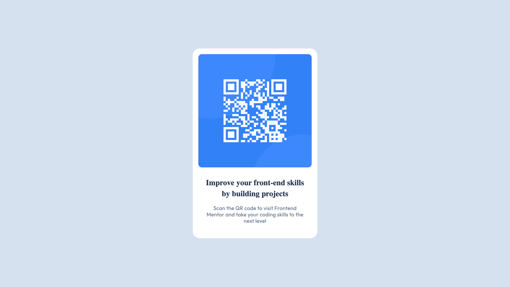

# Frontend Mentor - QR code component solution

This is a solution to the [QR code component challenge on Frontend Mentor](https://www.frontendmentor.io/challenges/qr-code-component-iux_sIO_H).

## Table of contents

- [Overview](#overview)
  - [Screenshot](#screenshot)
  - [Links](#links)
- [My process](#my-process)
  - [Built with](#built-with)
  - [Continued development](#continued-development)
- [Author](#author)

## Overview

### Screenshot

### Links

- Solution URL: [View my submitted solution on FrontendMentor.io](https://www.frontendmentor.io/solutions/qr-code-component-with-only-html-and-css-pbphSz0zAY)
- Live Site URL: [Live Hosted App Link](https://apatel544.github.io/qr-code-component/)

## My process

  How I started was by taking a look at the design templates given and creating div-containers in the index.html to divide the components. I then proceeded add the img, h1, and p tags for the 3 main parts for the this component. After that, I created a style.css file and started adding styling based on the style guide. Then after some trial and error I was able to create the expected result!

### Built with

- HTML5 Elements
- CSS custom properties

### Continued development

I will continue developing my skillset primarily focusing on Responsive Design. A couple concepts I want to get better at are Specificity and Positioning but also wanting to develop my grid and layout knowledge.

## Author

- Website - [Ankur Patel](https://www.your-site.com)
- Frontend Mentor - [@apatel544](https://www.frontendmentor.io/profile/apatel544)
- LinkedIn - [@ankurpatel-1](https://www.linkedin.com/in/ankurpatel-1/)
